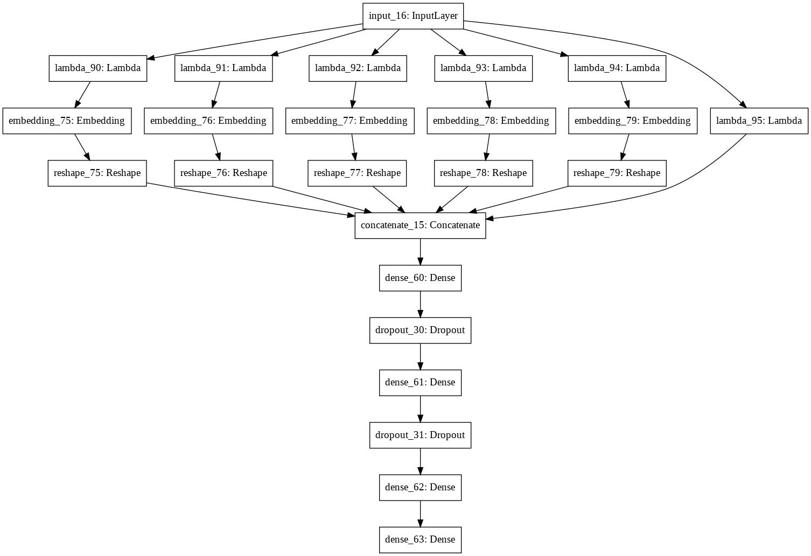

 
# Intrusion Detection System (IDS)

Academic research in the field of **Deep Learning**

## The Dataset:

This project made use of the CIC-IDS-2017, found here:https://www.unb.ca/cic/datasets/ids-2017.html .

<table>
  <tr>
    <th>#</th>
    <th>Species</th>
    <th>Count</th>
  </tr>

  <tr>
    <td>1</td>
    <td>Lactobacillus johnsonii</td>
    <td>20</td>
  </tr>

  <tr>
    <td>2</td>
    <td>Listeria monocytogenes</td>
    <td>22</td>
  </tr>

  <tr>
    <td>3</td>
    <td>Propionibacterium acnes</td>
    <td>23</td>
  </tr>

  <tr>
    <td>4</td>
    <td>Veionella</td>
    <td>22</td>
  </tr>

  <tr>
    <td>5</td>
    <td>Staphylococcus aureus</td>
    <td>20</td>
  </tr>

  <tr>
    <td>6</td>
    <td>Enterococcus faecium</td>
    <td>20</td>
  </tr>

  <tr>
    <td>7</td>
    <td>Lactobacillus gasseri</td>
    <td>20</td>
  </tr>

  <tr>
    <td>8</td>
    <td>Streptococcus agalactiae</td>
    <td>20</td>
  </tr>

  <tr>
    <td>9</td>
    <td>Actinomyces Israeli</td>
    <td>23</td>
  </tr>

  <tr>
    <td>10</td>
    <td>Fusobacterium</td>
    <td>23</td>
  </tr>

  <tr>
    <td>11</td>
    <td>Pseudomonas aeruginosa</td>
    <td>20</td>
  </tr>

  <tr>
    <td>12</td>
    <td>Lactobacillus plantarum</td>
    <td>20</td>
  </tr>

  <tr>
    <td>13</td>
    <td>Lactobacillus reuteri</td>
    <td>20</td>
  </tr>

  <tr>
    <td>14</td>
    <td>Clostridium perfringens</td>
    <td>23</td>
  </tr>

  <tr>
    <td>15</td>
    <td>Neisseria gonorrhoeae</td>
    <td>23</td>
  </tr>

  <tr>
    <td>16</td>
    <td>Proteus</td>
    <td>20</td>
  </tr>

  <tr>
    <td>17</td>
    <td>Acinetobacter baumanii</td>
    <td>20</td>
  </tr>

  <tr>
    <td>18</td>
    <td>Lactobacillus casei</td>
    <td>20</td>
  </tr>

  <tr>
    <td>19</td>
    <td>Bacteroides fragilis</td>
    <td>23</td>
  </tr>

  <tr>
    <td>20</td>
    <td>Porfyromonas gingivalis</td>
    <td>23</td>
  </tr>

  <tr>
    <td>21</td>
    <td>Escherichia coli</td>
    <td>20</td>
  </tr>

  <tr>
    <td>22</td>
    <td>Lactobacillus crispatus</td>
    <td>20</td>
  </tr>

  <tr>
    <td>23</td>
    <td>Bifidobacterium spp</td>
    <td>23</td>
  </tr>

  <tr>
    <td>24</td>
    <td>Staphylococcus epidermidis</td>
    <td>20</td>
  </tr>

  <tr>
    <td>25</td>
    <td>Staphylococcus saprophiticus</td>
    <td>20</td>
  </tr>

  <tr>
    <td>26</td>
    <td>Lactobacillus salivarius</td>
    <td>20</td>
  </tr>

  <tr>
    <td>27</td>
    <td>Lactobacillus delbrueckii</td>
    <td>20</td>
  </tr>

  <tr>
    <td>28</td>
    <td>Lactobacillus jehnsenii</td>
    <td>20</td>
  </tr>

  <tr>
    <td>29</td>
    <td>Candida albicans</td>
    <td>20</td>
  </tr>

  <tr>
    <td>30</td>
    <td>Lactobacillus rhamnosus</td>
    <td>20</td>
  </tr>

  <tr>
    <td>31</td>
    <td>Micrococcus spp</td>
    <td>21</td>
  </tr>

  <tr>
    <td>32</td>
    <td>Lactobacillus paracasei</td>
    <td>20</td>
  </tr>

  <tr>
    <td>33</td>
    <td>Enterococcus faecalis</td>
    <td>20</td>
  </tr>

  <tr>
    <td colspan="2" style="text-align:center"><b>Total</b></td>
    <td><b>689</b></td>
  </tr>
</table>
 
## The Model:
the architecture has been devolop by uasing hyper parameter tuning feature of keras library. A Stratified-5-Folds cross validation was used to validate the performance of the model, An average of **99.87%** accuracy has been achieved, competing and even beating published State-of-The-Art models. The Keras library was used with Tensorflow backend.

The accuracy of the folds..
|Fold|Validation accuracy (%)|
|:---:|:---:|
|Fold-1 |99.97%|
|Fold-2 |99.98%|
|Fold-3 |99.96%|
|Fold-4 |99.47%|
|Fold-5 |99.96%|
|**Average**|**99.87%**|

A. Alaodat: **For-a-better-Intrusion-Detection-System-using-Deep-Learning**
